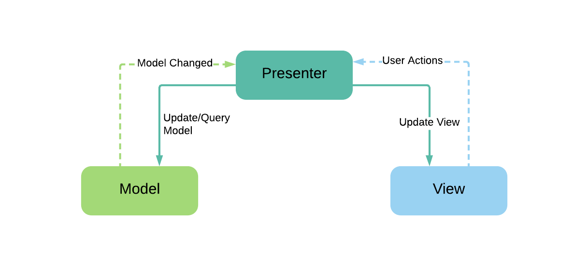
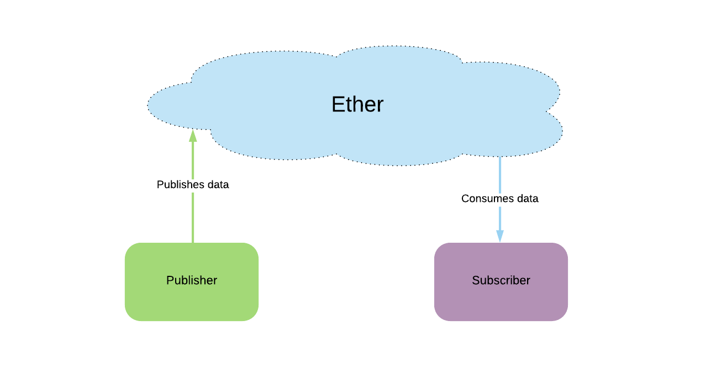

# Ether

Ether is a simple [PubSub](https://en.wikipedia.org/wiki/Publish%E2%80%93subscribe_pattern) architecture framework for publishing and subscribing data. 

Problems that are solved using model-view architectures can be solved much easily using Ether framework using the PubSub architecture.

**Why Ether?**

Let us look at a common model-view architecture - MVP



MVP succeeds in separating Model and View, but Presenter is left with the responsibility of gluing this together. Presenter will be dependent on both Model and View. 

As the complexity of your code grows, so is the complexity of Presenter. 

But what exactly is Presenter's role? At its core, it get the data from Model and pass it to View

Imagine if you could just 

* Focus on how to produce the data -- without worrying about who consumes it or how it is send to consumer
* Focus on how to consume the data -- without worrying about who produces it or how it is delivered

All that is left is focus on your application logic. Produce the data, and consume it.  
 
This is what Ether provides

With Ether the above architecture can be simplified as




Here is a comparison of how a simple problem is solved using [MVP](https://github.com/josesamuel/ether/tree/master/MVPSample/src/main/java/sample/mvp) vs [Ether](https://github.com/josesamuel/ether/tree/master/EtherSample/src/main/java/sample/ether) PubSub


Getting Ether
--------

Gradle dependency

```groovy
dependencies {

	//Java library
	implementation 'com.josesamuel:ether:1.0.0'
    kapt 'com.josesamuel:ether-processor:1.0.0'
   
    //If you want observable extensions (RxJava) on top of the above, use the following instead 
    implementation 'com.josesamuel:ether-observable:1.0.0'
    kapt 'com.josesamuel:ether-observable-processor:1.0.0'

}
```
License
-------

    Copyright 2018 Joseph Samuel

    Licensed under the Apache License, Version 2.0 (the "License");
    you may not use this file except in compliance with the License.
    You may obtain a copy of the License at

       http://www.apache.org/licenses/LICENSE-2.0

    Unless required by applicable law or agreed to in writing, software
    distributed under the License is distributed on an "AS IS" BASIS,
    WITHOUT WARRANTIES OR CONDITIONS OF ANY KIND, either express or implied.
    See the License for the specific language governing permissions and
    limitations under the License.


